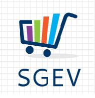

# Sistema de Gestão de Estoque e Vencimento (SGEV)

 <a href="#ojetivo">Objetivo</a> | 
 <a href="#tecnologias">Tecnologias</a> | 
 <a href="#licença">Licença</a> | 

 

  

## Objetivo
O SGEV é um sistema desktop para auxiliar as empresas a controlar a data de validade dos produtos em seu estoque.

## Tecnologias
- [Python](https://www.python.org/)
- [Qt](https://www.qt.io/qt-for-python)

## Licença
Esse projeto está sob a licença GNU GENERAL PUBLIC LICENSE. Veja o arquivo [LICENSE](LICENSE.md) para mais detalhes.
